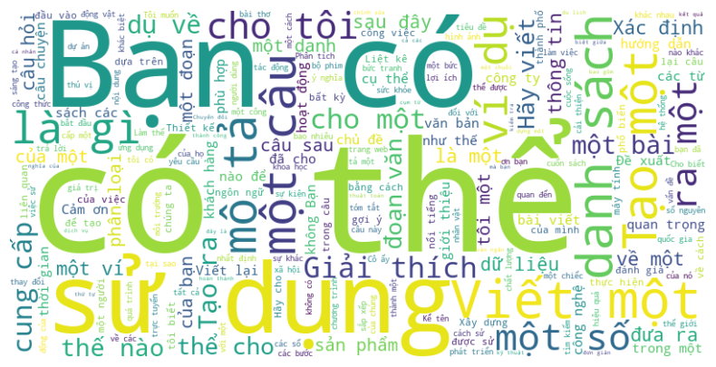

# Vietnamese Chatbot Safety 

  

## Introduction
The Vietnamese Chatbot Safety project develops a Safety model trained on Vietnamese data to detect unsafe input and ensure responsible chatbot interactions. This enhances user safety by identifying inappropriate content and maintaining ethical communication standards.
## Key Features
* **Safety Detection**: Detects harmful, offensive, and inappropriate content.
* **Dual-Model System**: Uses both classification and generation models for enhanced safety.
* **Fine-Tuned on Vietnamese Data**: Ensures high accuracy for Vietnamese conversations.
## Data Training
- We have collected, preprocessed, and validated data from Hugging Face, Kaggle, and GitHub. You can review the process in the `Data_Validation` folder.
- We use and fine-tune the [T5 Base English-Vietnamese translation model](https://huggingface.co/NlpHUST/t5-en-vi-base) from [NLP HUST](https://huggingface.co/NlpHUST). You can review it in `Data_Validation\train_vi_translate_model.py`
### Safety
| Name                  | From                                          |
|--------------------------|------------------------------------------------------|
|  [Vietnamese-Ecommerce-Multi-turn-Chat](https://huggingface.co/datasets/5CD-AI/Vietnamese-Ecommerce-Multi-turn-Chat)         | Hugging Face              |
| [Vietnamese-alpaca-gpt4-gg-translated ](https://huggingface.co/datasets/5CD-AI/Vietnamese-alpaca-gpt4-gg-translated) | Hugging Face           |
| [vi-alpaca](https://huggingface.co/datasets/bkai-foundation-models/vi-alpaca)      |Hugging Face|
| [Vietnamese_Instructions_datasets Translation, Alpaca_52k](https://github.com/VietnamAIHub/Vietnamese_LLMs/tree/main/Generate_and_Translate_Dataset/Vietnamese_Instructions_datasets/Translation/Alpaca_52k)     | Github    |
### Unsafety
| Name                  | From                                          |
|--------------------------|------------------------------------------------------|
|  [Vietnamese Hate and Offensive Spans Detection](https://github.com/phusroyal/ViHOS)         | Github           |
| [ETHOS Hate Speech Dataset](https://www.kaggle.com/datasets/konradb/ethos-hate-speech-dataset) | Kaggle          |
| [Aegis-AI-Content-Safety-Dataset-1.0](https://huggingface.co/datasets/nvidia/Aegis-AI-Content-Safety-Dataset-1.0)      |Hugging Face|
| [CategoricalHarmfulQA](https://huggingface.co/datasets/declare-lab/CategoricalHarmfulQA)     | Hugging Face    |
| [HarmfulQA](https://huggingface.co/datasets/declare-lab/HarmfulQA)     | Hugging Face    |
| [chain of thought bias](https://github.com/SALT-NLP/chain-of-thought-bias)     | Github   |

## Model Training
We finetune two models: one for safety classification and another for chatbot response generation. The training is conducted in multiple stages to ensure optimal performance.
### Safety Classification Model
Classify user inputs into unsafe categories: 
- Criminal Planning/Confessions
- Fraud & Legal Violations
- Harassment
- Hate
- Offensive & Harmful Language
- Threat & Violence
  
Training:
- Fine-tune [Distilbert base vietnamese case](https://huggingface.co/pengold/distilbert-base-vietnamese-case) model for multi-label classification on collected datasets.
- Use focal loss to improve recall on unsafe categories.
- Apply data augmentation to balance class distribution.
- Evaluate using precision, recall, and F1-score.
### Chatbot Response Model
Finetune [PhoGPT 4B](https://huggingface.co/vinai/PhoGPT-4B) for chatbot response generation on safe dataset.
